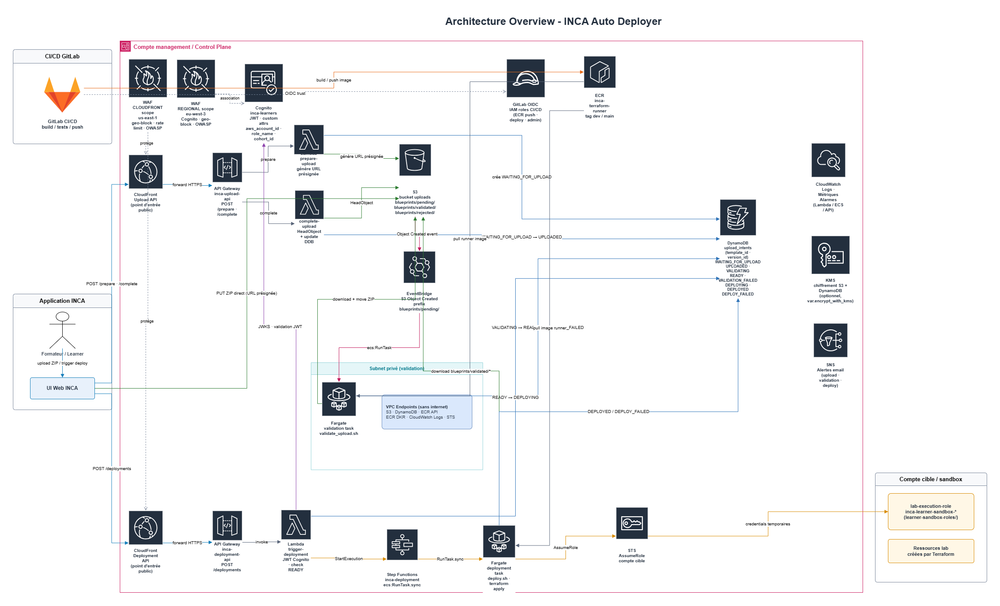

# INCA Auto Deployer

## Table of Contents

- [Introduction](#introduction)
- [Global Architecture](#global-architecture)
- [What This Repository Contains](#what-this-repository-contains)
- [Index](#index)
- [Overview Of The 4 Flows](#overview-of-the-4-flows)
  - [1. Image Build And Push / CI/CD](#1-image-build-and-push--cicd)
  - [2. Upload Flow](#2-upload-flow)
  - [3. Validation Flow](#3-validation-flow)
  - [4. Deployment Flow](#4-deployment-flow)
- [Quick Repository Map](#quick-repository-map)
- [Tests](#tests)
  - [Unit Tests](#unit-tests)
  - [Integration Tests](#integration-tests)
  - [Smoke Tests](#smoke-tests)
- [Current Project Status](#current-project-status)

## Introduction

This repository contains the AWS technical building blocks that allow INCA to manage, validate, and execute Terraform packages without placing that load directly on the business application.

Concretely, this project currently covers four areas that are already operational :

- the build and publication of a Terraform runner image in Amazon ECR;
- the foundation of the Terraform package upload flow through S3, DynamoDB, API Gateway, and Lambda;
- the first end-to-end implementation of the Terraform package validation flow through EventBridge and ECS Fargate;
- the first implementation of the Terraform deployment flow through Cognito authentication, Step Functions, and ECS Fargate.

## Global Architecture

The following diagram provides a high-level overview of the INCA Auto Deployer architecture, including the upload, validation, and deployment flows.



## What This Repository Contains

The main components currently present are:

- a Debian-based Terraform runner Docker image, with `terraform`, `awscli`, and an embedded offline Terraform provider mirror for the current supported baseline;
- shell scripts for Terraform validation and execution;
- Terraform stacks for Amazon ECR and the IAM roles used by GitLab OIDC;
- a GitLab CI/CD layout split between a parent orchestrator pipeline, a dedicated runner-image child pipeline, a dedicated application infrastructure child pipeline, and a dedicated AWS bootstrap foundation child pipeline;
- a backend foundation for the Terraform template upload flow;
- a dedicated validation foundation built around S3, EventBridge, ECS Fargate, private networking, and DynamoDB state transitions;
- a deployment foundation built around Cognito, API Gateway, Step Functions, and ECS Fargate for executing Terraform packages in sandbox accounts;
- architecture and operator documentation describing all four flows.

## Index

1. this `README.md` to understand the overall vision;
2. [`docs/cicd/pipeline-reference.md`](docs/cicd/pipeline-reference.md) for the CI/CD pipeline structure, job list, and pipeline variables;
3. [`docs/upload/upload-flow-architecture.md`](docs/upload/upload-flow-architecture.md) for the upload flow currently implemented;
4. [`docs/validation/validation-flow-architecture.md`](docs/validation/validation-flow-architecture.md) for the current validation architecture;
5. [`docs/deployment-foundation/deployment-foundation.md`](docs/deployment-foundation/deployment-foundation.md) for the deployment flow architecture;
6. [`docs/upload/upload-package-guide.md`](docs/upload/upload-package-guide.md) for the user-facing guidance on Terraform ZIP packages.

## Overview Of The 4 Flows

### 1. Image Build And Push / CI/CD

The repository contains a Docker runner intended to execute Terraform in a controlled environment. This image includes the runtime prerequisites for ECS Fargate execution: shell, system tools, `terraform`, `awscli`, runner scripts, and an embedded Terraform provider mirror for the currently approved provider baseline.

The build and publication of this image are managed by a dedicated GitLab CI/CD child pipeline. AWS authentication does not rely on static credentials: the pipeline uses GitLab OIDC to call `AssumeRoleWithWebIdentity`, obtain temporary credentials, and then push the versioned image to Amazon ECR.

This flow is already operational for:

- testing GitLab authentication to AWS;
- testing the runner scripts, shell syntax, and offline provider mirror behavior against supported and unsupported fixtures;
- pushing the image to ECR automatically from the integration and mainline branches.

Detailed documentation:

- [`docs/cicd/pipeline-reference.md`](docs/cicd/pipeline-reference.md)

### 2. Upload Flow

The upload flow is the first business-facing building block exposed for Terraform packages. Its goal is to allow a client to upload a Terraform ZIP securely without passing the file through the application backend.

The current principle is as follows:

1. the client requests upload preparation;
2. the backend generates opaque identifiers and creates an upload intent in `PENDING`;
3. the backend returns a presigned S3 URL;
4. the client uploads the ZIP directly to S3;
5. a completion endpoint verifies the stored object and then moves the status to `UPLOADED`.

This part is already implemented and tested. It forms the entry point used by the validation flow.

Detailed documentation:

- [`docs/upload/upload-flow-architecture.md`](docs/upload/upload-flow-architecture.md)
- [`docs/upload/upload-package-guide.md`](docs/upload/upload-package-guide.md)

### 3. Validation Flow

The validation flow corresponds to the phase in which an uploaded Terraform package is technically checked before being considered usable. The first implementation is now deployed in `dev` and uses native S3 events routed through EventBridge to launch an ECS Fargate task in private subnets.

The current runtime sequence is:

1. the upload completion endpoint marks the package as `UPLOADED`;
2. S3 emits an `Object Created` event to EventBridge;
3. an EventBridge rule filters the raw upload prefix and triggers an ECS Fargate task;
4. the runner downloads the ZIP from S3, extracts it, and runs the Terraform checks;
5. the runner updates the DynamoDB intent state to `VALIDATING`, then `VALIDATED` or `VALIDATION_FAILED`.

In the current version, this flow covers:

- verification of the expected package structure;
- the `terraform fmt -check`, `terraform init -backend=false`, and `terraform validate` checks;
- publication of the validation result in DynamoDB;
- CloudWatch logging for validation task execution;
- private execution without runtime Internet egress thanks to VPC endpoints and an embedded provider mirror.

Important constraints to keep in mind:

- the first supported provider baseline is `registry.terraform.io/hashicorp/aws` in version `5.100.0`;
- unsupported providers or unsupported versions are currently outside the allowed validation scope;
- the first validation implementation does not rely on Step Functions;
- deployment after validation is handled by the deployment flow (see section 4).

Detailed documentation:

- [`docs/validation/validation-flow-architecture.md`](docs/validation/validation-flow-architecture.md)
- [`docs/upload/upload-package-guide.md`](docs/upload/upload-package-guide.md)

### 4. Deployment Flow

The deployment flow is the final step in the chain. Its role is to take a previously validated Terraform artifact and execute it in an isolated way on one or more AWS sandbox accounts.

The target architecture describes a model in which:

- INCA remains the business entry point;
- Step Functions orchestrates the global workflow;
- ECS Fargate executes the Terraform runner;
- the runner assumes an IAM role in each target account;
- each account has its own Terraform state and its own execution statuses.

This flow is implemented and operational in `dev`. It covers:

- Cognito authentication for deployment request submission;
- an HTTP API Gateway entry point that triggers a Step Functions state machine;
- ECS Fargate execution of the Terraform runner in a sandbox account;
- DynamoDB status tracking (`DEPLOYING → DEPLOYED / DEPLOYMENT_FAILED`);
- IAM roles in target sandbox accounts (`learner-sandbox-roles` stack).

Detailed documentation:

- [`docs/deployment-foundation/deployment-foundation.md`](docs/deployment-foundation/deployment-foundation.md)

## Quick Repository Map

The most useful directories and files for taking over the project are:

- `Dockerfile`: definition of the runner image;
- `scripts/`: shell scripts used locally and in the image;
- `.gitlab-ci.yml`: parent GitLab CI/CD orchestrator;
- `ci/runner.yml`: child pipeline dedicated to the runner image lifecycle;
- `ci/inca-pipeline.yml`: child pipeline dedicated to infrastructure delivery (upload, validation, deployment, WAF, CloudFront, Cognito);
- `ci/bootstrap.yml`: child pipeline dedicated to GitLab OIDC, IAM, ECR, and bootstrap foundation administration changes;
- `terraform/state-backend/`: Terraform stack for the S3 remote state backend;
- `terraform/ecr/`: Terraform stack for the ECR repository;
- `terraform/gitlab-oidc-roles/`: Terraform stack for IAM roles and GitLab OIDC integration;
- `terraform/upload-foundation/`: infrastructure for the upload foundation;
- `terraform/validation-foundation/`: dedicated Terraform stack for the validation flow foundation;
- `terraform/cognito/`: Terraform stack for Cognito user pool and app client;
- `terraform/deployment-foundation/`: infrastructure for the deployment flow (Step Functions, ECS, API Gateway);
- `terraform/learner-sandbox-roles/`: IAM roles in target sandbox accounts for ECS runner assumption;
- `terraform/waf-foundation/`: WAF web ACL for API protection;
- `terraform/cloudfront-foundation/`: CloudFront distribution in front of upload and deployment APIs;
- `lambdas/`: Lambda handlers for the upload flow;
- `tests/`: unit and integration tests;
- `docs/`: architecture, CI/CD, upload, validation, and deployment documentation.

## Tests

### Unit Tests

The Lambda handlers have colocated Python unit tests covering request validation, status transitions, and response structure.

```bash
pip install pytest boto3
pytest lambdas/prepare-upload/tests/
pytest lambdas/complete-upload/tests/
pytest lambdas/trigger-deployment/tests/
```

### Integration Tests

The scripts in `tests/integration/` exercise the runner scripts and the deployed AWS foundations. Each script requires the relevant infrastructure to be running.

| Script | What it tests | Required env vars |
|---|---|---|
| `test_offline_provider_mirror.sh <fixture> <success\|failure>` | `validate.sh` behavior with a local filesystem mirror — no AWS access required | `TERRAFORM_AWS_PROVIDER_VERSION` (optional, defaults to `5.100.0`) |
| `test_upload_foundation_flow.sh <fixture-dir>` | Upload API prepare → S3 upload → complete intent status transition | `API_URL`, `AWS_REGION`, `UPLOAD_INTENTS_TABLE_NAME` |
| `test_validation_foundation_flow.sh <fixture-dir> [status] [timeout]` | Full validation flow from upload through ECS Fargate to DynamoDB status | `API_URL`, `AWS_REGION`, `UPLOAD_INTENTS_TABLE_NAME` |
| `test_deployment_foundation_flow.sh <fixture-dir> [timeout]` | End-to-end deployment flow including Cognito auth and Step Functions execution | `API_URL`, `DEPLOYMENT_API_URL`, `DEPLOYMENT_STATE_MACHINE_ARN`, `UPLOAD_INTENTS_TABLE_NAME`, `COGNITO_USER_POOL_ID`, `COGNITO_CLIENT_ID`, `AWS_REGION` |

### Smoke Tests

End-to-end smoke tests run automatically in CI after each deployment and are not intended to be run manually. They cover the upload, validation, and deployment flows against the live `dev` and `main` environments. See [`docs/cicd/pipeline-reference.md`](docs/cicd/pipeline-reference.md) for the full job list and pipeline structure.

## Current Project Status

Today, the following topics can be considered validated:

- the Docker runner builds correctly;
- the image publication flow runs in its own dedicated child pipeline and publishes explicit environment tags;
- the runner image embeds the current offline Terraform provider baseline used by the validation runtime;
- the upload flow foundation is implemented;
- the upload flow unit tests exist;
- the validation flow foundation is deployed and works end to end in `dev` for the current supported provider scope;
- the deployment flow foundation is deployed and works end to end in `dev` (Cognito auth, Step Functions, ECS Fargate runner, DynamoDB status tracking);
- the pipeline is explicitly separated between runner-image concerns, infrastructure delivery, and bootstrap foundation administration;
- smoke tests now exist for the offline provider mirror and for the upload, validation, and deployment business flows;
- infrastructure delivery now uses explicit stack-scoped manual deployment and destroy jobs after separate plans.

However, the following points remain topics for further build-out or industrialization:

- promotion of the deployment flow to the `main` environment;
- WAF and CloudFront stacks exist but are not yet applied to either environment;
- richer validation reporting and failure diagnostics;
- broader provider support lifecycle beyond the initial embedded baseline;
- duplicate-event hardening and state-transition robustness;
- multi-account sandbox deployment routing;
- final convergence with the INCA application control plane.
